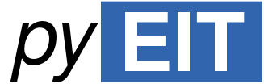
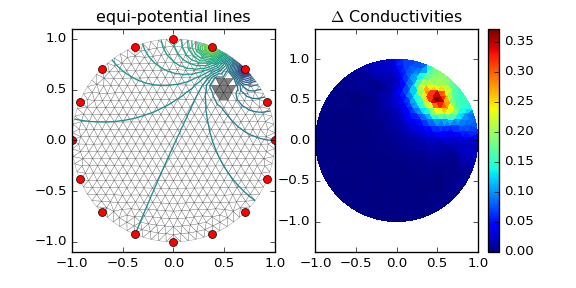
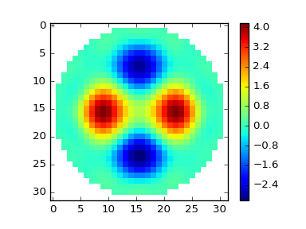
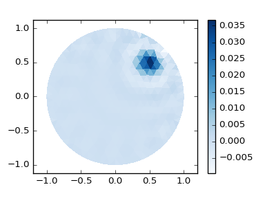
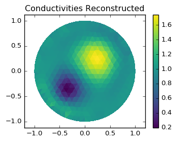

# 

*A python-based, open-source package for Electrical Impedance Tomography (EIT)*

**Principles: modularity, minimalism, easy extensibility!**

## 1. Introduction

### 1.1 Dependencies

| Packages |  Optional | Note |
| ---- | ---- | ---- |
| **numpy** | | tested with `numpy-1.10.4`, `numpy-1.11.rc1` |
| **scipy** | | tested with `scipy-0.17.0` |
| **matplotlib** | | tested with `matplotlib-1.5.1` |
| **vispy** |  *Optional* | tested with `vispy-git` |
| **pandas** | *Optional* | tested with `pandas-0.17.1` |
| **xarray** | *Optional* | for long term data analysis |
| **distmesh** | *Optional* | it currently has a build-in distmesh module (supports 2D and 3D!) |
| **tetgen** | *Optional* | generate 3D meshes |

**Note 1, Why vispy ?** `pyEIT` uses `vispy` for visualizing (optional) 3D meshes (tetrahedron). `vispy` has minimal system dependencies, all you need is a decent graphical card with `OpenGL` support. It supports fast rendering, which I think is more superior to `vtk` or `mayavi` especially for python 3 support. Please go to the website [vispy.org](http://vispy.org/) or github repository [vispy.github](https://github.com/vispy/vispy) for more details.

**Note 2, How to contribute ?** The interested user can contribute **(create a PR! any type of improvement is welcome)** forward simulation, inverse solving algorithms as well as their models at current stage. We will setup a wiki page dedicated to this topic.

**Note 3, Fast setup.** [Anaconda from continuum](https://www.continuum.io/downloads) is highly recommended for this package. PyEIT is purely python and has minimal dependencies. It can be run directly on an existing anaconda environment (`python-2.7` and `python-3.5`).

### 1.2 Features

 - [x] 2D forward and inverse computing of EIT
 - [x] Reconstruction algorithms : Gauss-Newton solver (JAC), Back-projection (BP), 2D GREIT
 - [x] 2D/3D visualization!
 - [x] Add support for 3D forward and inverse computing
 - [x] 3D mesh generation and visualization
 - [ ] Generate complex shape using distmesh
 - [ ] More algorithms and data pre-processing modules
 - [ ] Complete electrode model

## 2. Installation

`pyEIT` is purely python based (in current version), so it can be installed and run without any difficulty.

### 2.1 Install global

```
$ python setup.py build
$ python setup.py install
```

### 2.2 set PYTHONPATH (recommended)

```
export PYTHONPATH=/path/to/pyEIT
```

In windows, you may set `PYTHONPATH` as a system wide environment. If you are using `spyder-IDE`, or `pyCharm`, you may also set `PYTHONPATH` in the IDE, which is more convenient. Please refer to a specific tool for detailed information.

## 3. Run the demo

Enter the demo folder, pick one demo, and run !

### 3.1 (2D) forward and inverse computing

**Using** `demo/demo_dynamic_bp.py`



**Using** `demo/demo_dynamic_greit.py`



**Using** `demo/demo_dynamic_jac.py`



**Using** `demo/demo_static_jac.py`



### 3.2 (3D) forward and inverse computing

**Using** `demo/demo_forward3d.py`

**Using** `demo/demo_dynamic_jac3d.py`

**Notes:**

 - The 3D visualization can be adjusted using mouse wheels interactively. Seeking a perfect visualization mode, transparency or opaque, is in fact an individual taste. User can also use `mayavi` and `vtk` for visualization purpose.
 - Solving the inverse problem of 3D EIT, requires the electrodes to be placed at multiple altitude (z-axis) in order to have (better) z-resolution. This should be done carefully, as adding extra z-belt introduces more stimulation patterns, which in turn adds to the computational loads.

## 4. Contribute to pyEIT.

Please give `pyEIT` a **star** !!

How to contribute: **fork** and commit a pull request **(PR)** !!

## 5. Cite our work.

If you find `pyEIT` useful, please cite our work !

```bibtex
@inproceedings{liu2016pyeit,
  title={pyEIT: a python based, open source framework for EIT},
  author={Liu, Benyuan and Yang, Bin and Xu, Canhua and Xia, Junying and Dong, Xiuzhen and Fu, Feng},
  booktitle={17th International Conference on Electrical Impedance Tomography},
  pages={139},
  year={2016}
}
```
