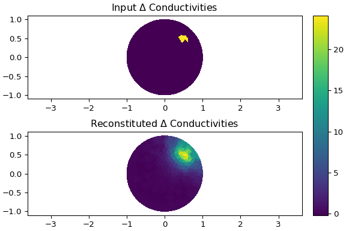
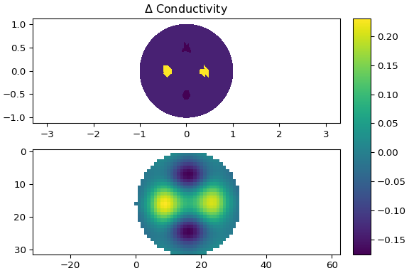
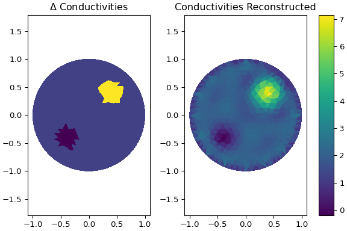

# 

Thank you for the interest in `pyEIT`!

`pyEIT` is **a python-based, open-source framework for Electrical Impedance Tomography (EIT).**

The design priciples of `pyEIT` are **modularity, minimalism, extensibility and OOP!**

## 1. Introduction

### 1.1 Dependencies

| Packages       | Optional   | Note                                     |
| -------------- | ---------- | ---------------------------------------- |
| **numpy**      |            | tested with `numpy-1.19.1`               |
| **scipy**      |            | tested with `scipy-1.5.0`                |
| **matplotlib** |            | tested with `matplotlib-3.3.2`           |
| **pandas**     | *Optional* | tested with `pandas-1.1.3`               |
| **vispy**      | *Optional* | failed with `vispy` in python 3.8        |
| **xarray**     | *Optional* | for large data analysis                  |
| **distmesh**   | *Optional* | A build-in module is provided in `pyEIT` |

**Q1, Why you choose vispy for 3D visualization?**

`pyEIT` uses `vispy` for visualizing 3D meshes (tetrahedron), and this module is not required if you are using 2D EIT only. `vispy` has minimal system dependencies and it is purely python. All you need is a decent graphical card with `OpenGL` support. It supports fast rendering, which I think is more superior to `vtk` or `mayavi` and it also has decent support for python 3. Please go to the website [vispy.org](http://vispy.org/) or github repository [vispy.github](https://github.com/vispy/vispy) for more details. Installation of vispy is simple by typing `python setup.py install`. We are also considering `mayavi` for a future version of `pyEIT`.

**Q2, How to contribute ?** 

Interested users can contribute **(create a PR! any type of improvement is welcome)** FEM forward simulations, inverse solving (EIT imaging) algorithms as well as their models. We will setup a wiki page dedicated to this topic.

**Q3, Fast setup.**

[Anaconda from continuum](https://www.continuum.io/downloads) is highly recommended for this package. PyEIT is purely python and has minimal dependencies.

### 1.2 Features

 - [x] 2D forward and inverse computing of EIT
 - [x] Reconstruction algorithms : Gauss-Newton solver (JAC), Back-projection (BP), 2D GREIT
 - [x] 2D/3D visualization!
 - [x] Add support for 3D forward and inverse computing
 - [x] 3D mesh generation and visualization
 - [ ] Generate complex shape using distmesh
 - [ ] Generate 2D/3D meshes from CT/MRI (based on iso2mesh [https://github.com/fangq/iso2mesh](https://github.com/fangq/iso2mesh))
 - [ ] Complete electrode model (CEM) support
 - [ ] Implementing the dbar algorithm for 2D difference EIT imaging

## 2. Installation

`pyEIT` is purely python based, it can be installed and run without any difficulty.

### 2.1 Install global

```
$ python setup.py build
$ python setup.py install
```

### 2.2 Install locally

User can track the git version of `pyEIT`, and using it locally by setting the `PYTHONPATH` variable. This method is recommended.

```
export PYTHONPATH=/path/to/pyEIT
```

Under windows, you may set `PYTHONPATH` as a system wide environment. If you are using `spyder`, or `pyCharm`, you may also set `PYTHONPATH` locally per project in the IDE, which is more convenient. Please refer to a specific tool for detailed information.

## 3. Run the demo

Enter the demo folder, pick one demo and run!

**Note:** the following images may be outdated due to that the parameters of a EIT algorithm may be changed in different versions of `pyEIT`. And it is there in the code, so just run the demo.

### 3.1 (2D) forward and inverse computing

**Using** `demo/demo_dynamic_bp.py`



**Using** `demo/demo_dynamic_greit.py`



**Using** `demo/demo_dynamic_jac.py`


**Using** `demo/demo_static_jac.py`



### 3.2 (3D) forward and inverse computing

**Using** `demo/demo_forward3d.py`

**Using** `demo/demo_dynamic_jac3d.py`

**Notes:**

 - 3D visualization plotted using `vispy` can be adjusted using mouse wheels interactively. Seeking a perfect visualization mode, transparency or opaque, is in fact an individual taste. User can also try `mayavi` and `vtk` for the visualization purpose using the unified 3D meshing structure.
 - Solving the inverse problem of 3D EIT, requires the electrodes to be placed at multiple altitude (z-axis) in order to have a (better) z-resolution. This should be done carefully, as adding extra z-belt introduces more stimulation patterns, which in turn adds to the computational loads.

## 4. Contribute to pyEIT.

Give `pyEIT` a **star**, **fork** this project and commit a pull request **(PR)** !

## 5. Cite our work.

`pyEIT` was published at the 17th International Conference on Electrical Impedance Tomography, 2016. It is now officially published at `softwareX`, vol (7), 2018. 

**If you find `pyEIT` useful, please cite our work!**

```bibtex
@article{liu2018pyeit,
  title={pyEIT: A python based framework for Electrical Impedance Tomography},
  author={Liu, Benyuan and Yang, Bin and Xu, Canhua and Xia, Junying and Dai, Meng and Ji, Zhenyu and You, Fusheng and Dong, Xiuzhen and Shi, Xuetao and Fu, Feng},
  journal={SoftwareX},
  volume={7},
  pages={304--308},
  year={2018},
  publisher={Elsevier}
}
```
